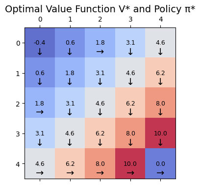
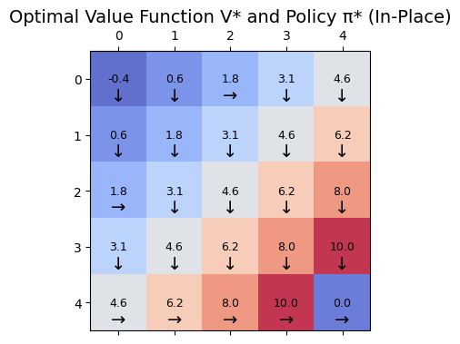
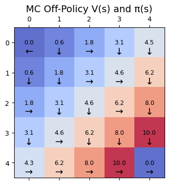

# CSCN8020 - Assignment 1  

Welcome to my repository for **Assignment 1 of CSCN8020**.  

This project implements and analyzes **four reinforcement learning problems**:  
1. **Problem 1** → Pick-and-Place Robot
2. **Problem 2** → 2x2 Gridworld (Iterations)
3. **Problem 3** → 5x5 Gridworld (In-place Value Iteration and Normal Value Iteration)
4. **Problem 4 **→ Off-policy Monte Carlo with Importance Sampling  

---

## 📓 Repository Content

- **Jupyter Notebook**  
  The main notebook is:  
  `Assignment 1 - ALL 4 Problems.ipynb`  
  In this notebook I explain step by step how I solved each problem, show the outputs, and provide final conclusions.  

- **Source Code**  
  Inside the `src/` folder I used the code provided in class as a base (`gridworld.py`, `value_iteration.py`, etc.).  
  For my solutions, I **modified the parameters directly in the notebook** to adapt them to the assignment requirements.  

- **Results & Visualizations**  
  I include heatmaps of value functions and greedy policies (π*) for:  
  - **Value Iteration normal**
    - 

  - **Value Iteration in-place**
    - 

  - **Monte Carlo Off-policy with IS**  
    - 

  These images are shown in the notebook and here in the repository to support the final conclusions.  

---

## 🚀 Quick Start

To run the notebook:  

```bash
# Create virtual environment
python -m venv venv 

# Activate (Windows PowerShell)
Set-ExecutionPolicy -ExecutionPolicy RemoteSigned -Scope Process
.\venv\Scripts\activate  

# Install dependencies
pip install -r requirements.txt
